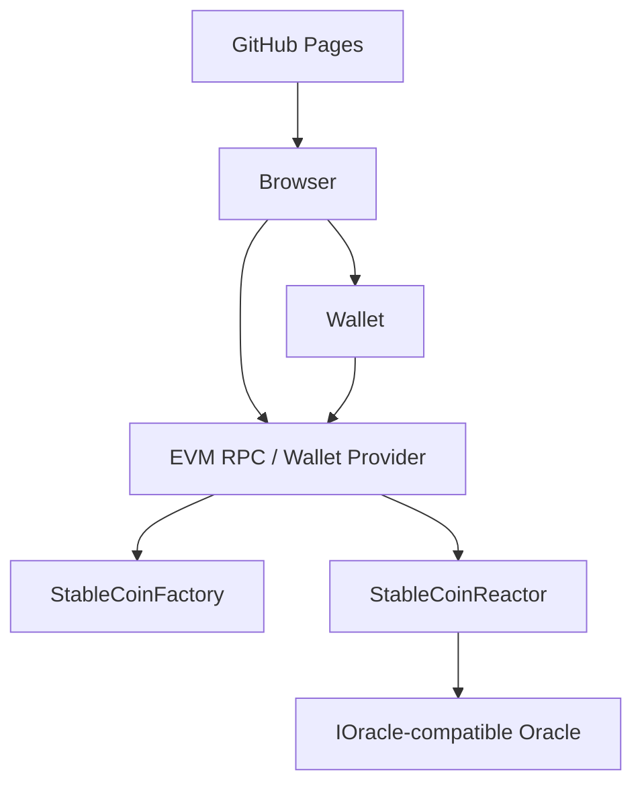

<div align="center">
  
  &nbsp;&nbsp;&nbsp;&nbsp;
  
</div>

&nbsp;

<div align="center">

# Gluon-EVM WebUI

**A fully static browser interface for interacting directly with the Gluon-EVM protocol.**

Developed under [**Stability Nexus**](https://github.com/StabilityNexus)

[](https://github.com/StabilityNexus/Gluon-EVM-WebUI/actions/workflows/ci.yml)
[](https://github.com/StabilityNexus/Gluon-EVM-WebUI/actions/workflows/nextjs.yml)
[](https://nextjs.org/)
[](https://www.typescriptlang.org/)

</div>

<p align="center">
  <a href="https://t.me/StabilityNexus">
    
  </a>
  &nbsp;
  <a href="https://x.com/StabilityNexus">
    
  </a>
  &nbsp;
  <a href="https://discord.gg/YzDKeEfWtS">
    
  </a>
  &nbsp;
  <a href="https://linkedin.com/company/stability-nexus">
    
  </a>
</p>

---

## Overview

Gluon-EVM WebUI is the frontend interface for the
[Gluon-EVM protocol](https://github.com/StabilityNexus/Gluon-EVM).

The application is designed to remain **fully static and deployable through GitHub Pages**.
Wallet connection, network selection, contract reads, approvals, and transaction signing happen
directly from the user's browser through the connected wallet and EVM RPC providers.

The WebUI does not operate a Gluon application server and must not redefine protocol accounting.
The deployed Gluon-EVM contracts remain the source of truth.

> [!WARNING]
> The current GitHub Pages deployment is a development preview. It does not imply that any reactor,
> token, oracle, or contract address shown by the interface is a production Gluon deployment.

---

## Features

- **Static GitHub Pages deployment** — Next.js is exported as static files
- **Wallet connectivity** — browser-side wallet connection and transaction signing
- **Multi-network configuration** — supported Gluon networks are defined centrally
- **Reactor creation** — configure and deploy reactors through a Gluon factory
- **Reactor explorer** — discover reactors from configured factories
- **Fission** — deposit reserve assets and receive Proton and Neutron
- **Fusion** — burn Proton and Neutron and withdraw reserve assets
- **Transmutation** — convert Proton to Neutron or Neutron to Proton
- **Oracle preflight** — validate oracle configuration before reactor creation
- **Reactor information** — display reserve, price, fee, oracle, treasury, and token information
- **Light and dark themes**
- **Responsive interface**
- **Automated quality checks** — TypeScript, ESLint, Vitest, accessibility, coverage, build, security, and performance checks

---

## How It Works

### Browser and Wallet Flow

The WebUI is served as static HTML, CSS, JavaScript, and assets.

The browser:

1. loads the static application from GitHub Pages
2. connects to a user wallet
3. reads the selected network and configured Gluon addresses
4. performs contract reads through wagmi/viem
5. prepares transactions in the browser
6. asks the wallet to sign and submit transactions
7. displays transaction and reactor state after confirmation

No Gluon application backend is required for the current architecture.

### Reactor Interaction

The WebUI supports the Gluon reactor flows exposed by the deployed protocol:

- fission
- fusion
- Proton to Neutron transmutation
- Neutron to Proton transmutation

The frontend must use the deployed contract interface and must not independently reproduce protocol
accounting as an alternative source of truth.

### Oracle Display

The selected reactor's configured oracle address is read from the deployed reactor.

The WebUI may display oracle information and preflight results, but it must not invent a production
oracle address or present undeployed oracle configuration as live.

---

## Architecture

The system has two main parts:

1. the **static WebUI** served from GitHub Pages
2. the **wallet / EVM interaction flow** used to read and write Gluon contracts

### WebUI Flow



- GitHub Pages serves the static frontend.
- The browser runs the application.
- The wallet controls signing.
- wagmi/viem provide browser-side EVM interaction.
- `StableCoinFactory` and `StableCoinReactor` remain the protocol source of truth.
- The reactor supplies its configured oracle address.

### Static Reactor Route

The interaction page uses the static route:

```text
/c?coin=0x...
```

The reactor address is read from the browser query string, avoiding a requirement for runtime
server rendering of arbitrary contract-address routes.

---

## Project Maturity

- [x] Core WebUI implemented
- [x] Wallet connectivity implemented
- [x] Factory / reactor discovery implemented
- [x] Reactor creation interface implemented
- [x] Fission interface implemented
- [x] Fusion interface implemented
- [x] Proton / Neutron transmutation interface implemented
- [x] Multi-network configuration implemented
- [x] Automated frontend tests configured
- [x] GitHub Pages workflow configured
- [x] Static-export architecture established
- [ ] Canonical OrbOracle WebUI deployment configuration documented
- [ ] End-to-end wallet-flow automation completed
- [ ] Production Gluon deployment registered
- [ ] Production security baseline completed

---

## Tech Stack

| Layer | Technology |
|---|---|
| Framework | Next.js 14 |
| UI | React 18 |
| Language | TypeScript |
| Styling | Tailwind CSS |
| Wallet | RainbowKit / wagmi |
| EVM Client | viem |
| Theme | next-themes |
| Animation | Framer Motion / GSAP |
| Tests | Vitest / Testing Library |
| Accessibility | axe-core |
| Deployment | GitHub Pages |
| CI | GitHub Actions |

---

## Repository Structure

```text
.
├── .github/
│   └── workflows/
├── app/
│   ├── [coinId]/
│   ├── create/
│   ├── explorer/
│   ├── globals.css
│   ├── layout.tsx
│   └── page.tsx
├── brand/
│   ├── Brand.md
│   ├── favicon.svg
│   ├── logo.svg
│   └── org-logo.svg
├── components/
├── providers/
├── scripts/
├── tests/
├── utils/
│   └── abi/
├── AGENTS.md
├── BestPracticesChecklist.md
├── CONTRIBUTING.md
├── Deployments.md
├── MAINTAINERS.md
├── SECURITY.md
├── next.config.mjs
├── package.json
└── README.md
```

---

## Getting Started

### Prerequisites

Install:

- [Git](https://git-scm.com/)
- [Node.js 20+](https://nodejs.org/)
- npm

Verify:

```bash
git --version
node --version
npm --version
```

### Clone the Repository

```bash
git clone https://github.com/StabilityNexus/Gluon-EVM-WebUI.git
cd Gluon-EVM-WebUI
```

### Install Dependencies

```bash
npm ci
```

### Environment Variables

Copy the browser-safe environment template:

```bash
cp .env.example .env.local
```

Example:

```text
NEXT_PUBLIC_WALLET_CONNECT_PROJECT_ID=your_walletconnect_project_id
```

Anything prefixed with `NEXT_PUBLIC_` is browser-visible and must never contain a secret.

---

## Usage

### Development Server

```bash
npm run dev
```

### Type Check

```bash
npm run typecheck
```

### Lint

```bash
npm run lint
```

### Tests

```bash
npm test
```

### Coverage

```bash
npm run test:coverage
```

### Accessibility

```bash
npm run test:a11y
```

### Dependency Security Triage

```bash
npm run security:audit
```

### Production Build

```bash
npm run build
```

A successful static production build writes the deployable site to:

```text
out/
```

### Check the Git Diff

```bash
git diff --check
```

---

## Deployment

The WebUI is intended to be deployed as a fully static GitHub Pages site.

The deployment flow is:

```text
Next.js static export
        ↓
out/
        ↓
GitHub Pages artifact
        ↓
GitHub Pages
```

The Pages workflow is:

```text
.github/workflows/nextjs.yml
```

The frontend must not require:

- Next.js API routes
- Server Actions
- runtime SSR
- middleware requiring a server runtime
- server-only secrets
- a separately deployed Gluon application backend

External wallet RPC providers and EVM networks are still required for blockchain interaction, but
they are not application servers operated by this WebUI.

For sitemap deployment, canonical URLs, the host-root robots.txt handoff, and
Google Search Console submission, see [Search indexing and sitemap deployment](docs/SEO.md).

---

## Configuring the WebUI

Network and contract configuration must remain centralized.

Do not duplicate contract addresses across pages or components.

Do not invent production deployment values.

See [Deployments.md](Deployments.md).

---

## Main WebUI Flows

### Create Reactor

The create flow collects and validates reactor configuration and submits the deployment through the
configured Gluon factory.

### Explore Reactors

The explorer reads configured factories and displays discovered reactors.

### Fission

The WebUI prepares reserve-token approval and fission transactions for the connected wallet.

### Fusion

The WebUI prepares the reactor fusion transaction and displays the required token/state information.

### Proton to Neutron Transmutation

The WebUI calls the deployed reactor's Proton-to-Neutron transmutation path.

### Neutron to Proton Transmutation

The WebUI calls the deployed reactor's Neutron-to-Proton transmutation path.

---

## OrbOracle

The WebUI must read the oracle associated with the selected reactor rather than hardcoding a
production OrbOracle address.

OrbOracle should only be presented as a supported deployment after its network, oracle address,
reactor configuration, and deployment provenance are verified and recorded in
[Deployments.md](Deployments.md).

---

## Contributing

See [CONTRIBUTING.md](CONTRIBUTING.md).

---

## Security

See [SECURITY.md](SECURITY.md).

---

## Maintainers

See [MAINTAINERS.md](MAINTAINERS.md).

---

## License

See [License.md](License.md).
